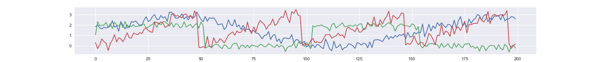
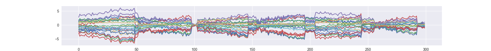
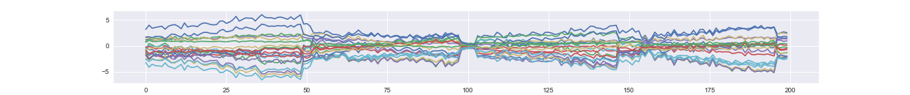
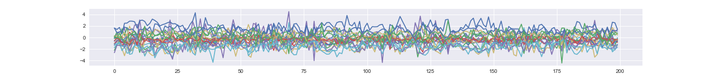

# LFADS implemented with Chainer
Implemenation of [Latent Factor Analysis via Dynamical Systems](https://www.nature.com/articles/s41592-018-0109-9)(Pandarinath ... and Sussillo et al., Nature Methods 2018) with [Chainer](https://chainer.org/). Official implementation by tensorflow is [here](https://github.com/tensorflow/models/tree/master/research/lfads).
LFADS is a sequential adaptation of a VAE (Variational Auto-Encoder). It can de-noise and find a low-dimensional representations for time series data. Although it is especially designed for investigating neuroscience data, it can be applied to any time series data.

MIT license. Contributions welcome.

This is the [blog post (only in Japanese)](http://tk-g.hatenablog.jp/entry/2018/11/26/000000) about this repository.

## Requirements
python 2.x, chainer 3.3.0, numpy, h5py

## Prepare dataset
Before training, you have to prepare the dataset. This is an example dataset.

```
python synth_data.py
```

It generates mixed signals from low-dimensional factors.

An example time series of a latent factor.


Corresponding mixed time series (i.e., observation).


## Train an LFADS model
Train LFADS without controller.
```
python run_lfads.py /path/to/dataset --gpu 0 --con-h-dims 0 --epoch 1000 --batch-size 64
```

Train LFADS with controller (Full model).
```
python run_lfads.py /path/to/dataset --gpu 0 --epoch 1000 --batch-size 64
```

## Evaluate a trained model

##### Take samples from posterior then average (denoising operation)
```
python run_posterior_sampling.py /path/to/trained/model --gpu 0 --nsample 5
```
An example reconstructed time series. The dimension of latent factor is 3, which is much lower than the dimension of observed time course (20).


An example estimated factor.


##### Take samples from prior distribution (generating completely new samples)
```
python run_prior_sampling.py /path/to/trained/model --gpu 0 --nsample 300
```


## TODO
* Sampling from poisson distribution
* External inputs
* Dynamic stitchng